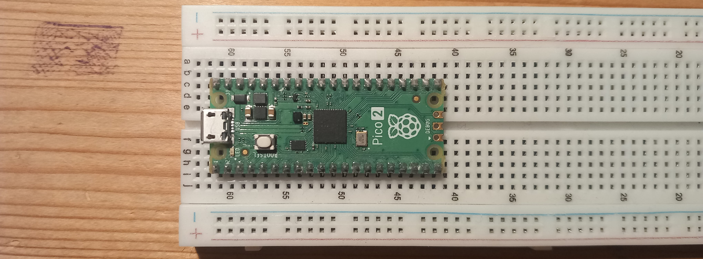

# hello-pico2

Collection of examples for sensors with the Raspberry Pi Pico2.

## Building

To build the program, use `cmake -Bbuild && cmake --build build`. In order to
load the program, you need to do the following steps.

- plug the Pi to your laptop while holding the button on the Pi, you should
  see it being detected in dmesg
- the operating system should have registered the Pi as a device in /dev,
  check this with `lsblk` and note which device is being used
- customize the `load.sh` file to use the correct device and load the selected
  program
- run `load.sh` with sudo priviledges

## Resources

- [Pi Pico2 Datasheet](https://datasheets.raspberrypi.com/pico/pico-2-datasheet.pdf) (for the GPIO voltage)
- [Pico SDK](https://datasheets.raspberrypi.com/pico/raspberry-pi-pico-c-sdk.pdf)
- [Pico 2 Examples](https://github.com/raspberrypi/pico-examples)
- [Kit Guide](https://docs.freenove.com/projects/fnk0058/en/latest/index.html)
